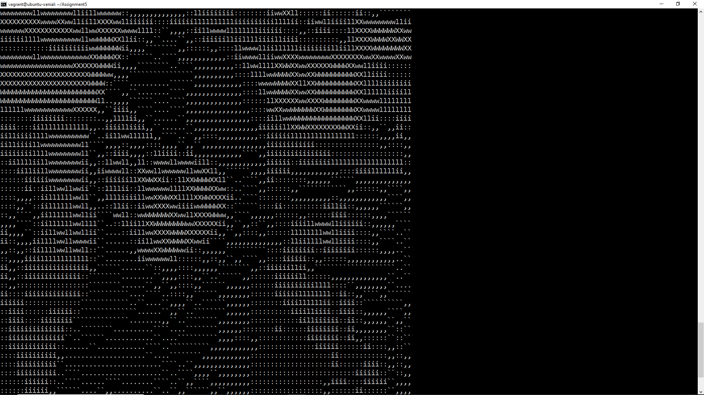

# pic2ascii

pic2ascii is an application I created to develop ASCII art from any .png file.

## Table of Contents

* [Installation and running the application](#install)
* [User Guide](#user)
* [Sample Run](#test)

## Installation and running the application <a name="install"></a>

First, clone or download a copy of the [pic2ascii program](https://github.com/yjkim97/pic2ascii).

Second, path to the appropriate folder with all the files and run the following code:

```
make all
```

This will compile all the source code into a few executables. 

## User Guide <a name="user"></a>

The application utilizes 2 programs. The first program png2rgb analyzes the picture to determine the brightness of each pixel. This program takes two parameters: the path to the picture and the width that the user wants to determine the ASCII art to be. For example:

```
png2rgb /test.png 50
```
will get the picture test.png and attain numerical values for each pixel as if the picture was 50 ASCII characters long. This means that the higher the number, the higher the quality of the ASCII art (you'll just need to zoom out)

The second program rgb2ascii utilize the output of the previous program and generate the ASCII art. For values representing darker colors, it will print bigger ASCII characters such as 'X' while less darker pixels will have smaller characters such as ','.

You can put the two programs together and run them like this:

```
png2rgb /test.png 200 | ./rgb2ascii
```

## Sample Run <a name="test"></a>
Sample run of the code:
```
png2rgb /picture.png 50 | ./rgb2ascii
```


```
png2rgb /picture.png 200 | ./rgb2ascii
```

